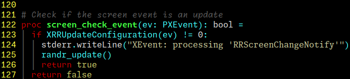

# Pangoterm with better alternate font support
This is a copy of Pangoterm from [here](https://www.leonerd.org.uk/code/pangoterm/)
but with improved support for alternate fonts through SGR 10-19 symbols. The
original seemed to have some very limited and partially disabled support. This
simply unlocks that potential and fixes a couple tiny issues with the original
implementation. By default it's set up to use [Monaspace](https://monaspace.githubnext.com/)
fonts, but if you create a config file with contents like this you can use any
fonts you like:

```
altfont:1="DejaVu Sans Mono"
altfont:2="Inconsolata Regular"
```


